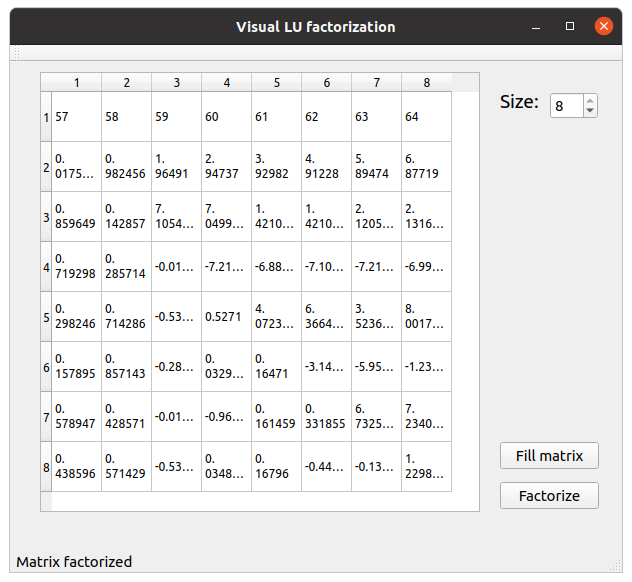

# Introduction
This application perform a LU factorizarion matrix that can be visualized by Qt. Once obtained
it also is able to obtain the inverse of the matrix.



The header only library based on C++ also provides methods to perform inversion of
the matrix by applying the backward and forward subtitution of the LU matrix. This is based
on the following LA definitions:

Having: $Ax = b$

we want to obtain: $A^{-1}*Ax=A^{-1}b  =>  x=A^{-1}b$

By factorizing A we have: $A = LU$ where U and L are the upper and lower matrix correspondingly.

If we use a permutation matrix then we have $pA = LU => A = p^{-1}LU$

So, we first factorize and then invert L and U. Multiplying the result we obtaing the inverted matrix:

$A^{-1} = U^{-1}L^{-1}*p$

# Building
```
meson builddir
ninja -C builddir
./builddir/visualLU
```

# Testing
```
mkdir -p subprojects
meson wrap install gtest
meson builddir -Dtests=true
```

# References
* https://courses.physics.illinois.edu/cs357/sp2020/notes/ref-9-linsys.html
